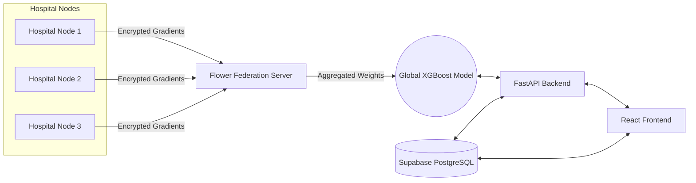

# 🏥 CareLink

> **Federated ML meets modern EHR — hospital-grade readmission prediction with zero patient data sharing.**

---

## 🌟 Core Features

| Feature | Name | Description |
| :---: | :--- | :--- |
| 🛡️ | **Privacy-First AI** | Leverages federated learning to train models on decentralized clinical data without raw data ever leaving the hospital firewall. |
| 🧠 | **Predictive Intelligence** | XGBoost-based readmission prediction flagging high-risk patients before discharge to optimize care pathways. |
| 📊 | **Clinical Dashboards** | Real-time, responsive analytics and patient overviews crafted with modern React and Recharts. |
| 🔬 | **SHAP Explainability** | Transparent AI that explains *why* a patient is high-risk, showing exactly which clinical factors drove the model's decision. |
| ⚡ | **Automated AI Triage** | Google Gemini-powered clinical triage that automatically assesses urgency based on free-text notes and vital signs. |
| 🎛️ | **Interactive ML Sandbox** | Real-time simulator computing live XGBoost probabilities, SHAP waterfall attributions, and clinical preset pathways. |
| 🎨 | **GSAP Light Mode Experience** | Fluid motion with GSAP ScrollTrigger, hand-drawn vector strokes, and a warm, clinical light theme inspired by nissh.info. |
| 🔐 | **Enterprise Security** | Granular Row-Level Security (RLS) powered by Supabase to ensure physicians only access their authorized patient rosters. |

---

## 🏗️ Architecture



---

## 🛠️ Tech Stack

| Layer | Technologies |
| :--- | :--- |
| **Frontend** | React 19, TypeScript, Vite, GSAP & @gsap/react (ScrollTrigger), Tailwind CSS, Recharts, Lucide React |
| **Backend** | Express.js (Node), FastAPI (Python), Netlify Functions |
| **Machine Learning**| XGBoost, Optuna, SHAP, Flower (Federated Learning v2.4) |
| **Database & Auth** | Supabase (PostgreSQL), Row Level Security (RLS) |
| **AI Triage** | Google Gemini 2.5 Flash API |
| **Design System** | Clean Light Mode Aesthetic (inspired by nissh.info and `docs/UI-UX.md`) |
| **Documentation** | 25+ comprehensive engineering blueprints in `docs/` |

---

## 🚀 Quick Start

Follow these steps to run CareLink locally.

### 1. Clone the Repository
```bash
git clone https://github.com/Niss54/Care-link.git
cd Care-link
```

### 2. Environment Setup
Copy the example environment file and fill in your keys.
```bash
cp .env.example .env.local
```

### 3. Supabase Database Setup
1. Create a new Supabase project.
2. Navigate to the SQL Editor in the Supabase Dashboard.
3. Copy the contents of `supabase/schema.sql` and run it to provision tables, triggers, and mock data.
4. Update your `.env.local` with the `VITE_SUPABASE_URL` and `VITE_SUPABASE_ANON_KEY`.

### 4. Run the ML Backend
```bash
cd backend
pip install -r requirements.txt
python main.py
```

### 5. Run the Frontend
Open a new terminal window.
```bash
npm install
npm run dev
```
The portal will be available at `http://localhost:3000`.

---

## 🔑 Environment Variables

| Variable | Description |
| :--- | :--- |
| `VITE_SUPABASE_URL` | Your Supabase project URL (e.g., `https://xyz.supabase.co`). |
| `VITE_SUPABASE_ANON_KEY` | Public anonymous key for Supabase client interactions. |
| `VITE_API_URL` | URL of the FastAPI backend (e.g., `http://localhost:8000`). |
| `GEMINI_API_KEY` | API key for the Google Gemini Triage Serverless Function. |

---

## 🤖 Machine Learning Model

### What it Predicts
The core CareLink AI predicts the probability of **30-day hospital readmission** for a patient, allowing clinical staff to intervene proactively and allocate resources effectively.

### Training Data
The baseline model is derived from the **MIMIC-IV** (Medical Information Mart for Intensive Care) database, encompassing roughly 40,000 critically ill patient records, pre-processed to extract vital signs, demographics, and lab results.

### Federated Learning
CareLink utilizes a Federated Learning approach using the Flower framework. Instead of centralizing sensitive patient records, the global model is sent to individual hospital nodes. Each node trains the model locally on its siloed data and only sends back the mathematical "gradients" (weight updates). These are aggregated centrally to improve the global model, ensuring privacy.

### SHAP Explainability
Black-box AI is dangerous in healthcare. CareLink uses SHapley Additive exPlanations (SHAP) to deconstruct every prediction. Clinicians are provided with a visual breakdown of exactly which patient factors (e.g., *Length of Stay*, *Prior Admissions*) increased or decreased their specific readmission risk.

### Performance Metrics
*Baseline parameters after Optuna hyperparameter optimization:*

| Metric | Score | Clinical Interpretation |
| :--- | :--- | :--- |
| **ROC-AUC** | `0.727` | Ranks a high-risk patient above a low-risk patient ~73% of the time. |
| **Recall** | `0.512` | Captures over half of all actual readmissions. |
| **Cohen's Kappa** | `0.318` | Demonstrates fair to good predictive agreement beyond random chance. |
| **Threshold** | `~0.42` | Optimized specifically to maximize Kappa over raw accuracy. |

---

## 🛡️ Privacy & Compliance

By separating the data layer from the intelligence layer, CareLink fundamentally supports HIPAA and GDPR compliance mandates. **Federated learning guarantees that no raw patient data, PII (Personally Identifiable Information), or PHI (Protected Health Information) ever leaves the hospital premises.** The central aggregation server mathematically cannot reverse-engineer individual patient records from the model gradients it receives.

---

## 🔌 API Endpoints

The Python FastAPI backend exposes the following primary ML routes:

| Method | Endpoint | Description |
| :--- | :--- | :--- |
| `GET` | `/patients` | Retrieves the list of risk-scored patients. |
| `GET` | `/predict/{patient_id}` | Generates a live risk prediction and SHAP analysis. |
| `POST` | `/feedback` | Accepts clinician feedback (confirm/override) for continual active learning. |

---

## 🤝 Contributing

We welcome contributions from developers, data scientists, and clinical professionals! Please open an issue first to discuss any major changes. Ensure that all new features include appropriate tests and maintain the strict privacy-first architecture of the platform.

---

## 📄 License

This project is licensed under the MIT License - see the LICENSE file for details.

---

## 🙏 Acknowledgements
*   **MIMIC-IV / PhysioNet**: For providing the critical care database used to baseline our ML models.
*   **Flower Framework**: For powering our federated learning orchestration.
*   **Google Gemini**: For enabling lightning-fast NLP clinical triage.
