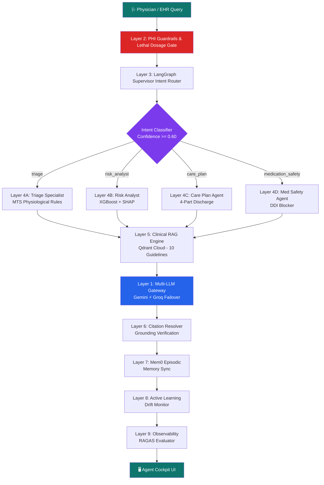

<div align="center">

```
 ██████╗ █████╗ ██████╗ ███████╗██╗     ██╗███╗   ██╗██╗  ██╗
██╔════╝██╔══██╗██╔══██╗██╔════╝██║     ██║████╗  ██║██║ ██╔╝
██║     ███████║██████╔╝█████╗  ██║     ██║██╔██╗ ██║█████╔╝ 
██║     ██╔══██║██╔══██╗██╔══╝  ██║     ██║██║╚██╗██║██╔═██╗ 
╚██████╗██║  ██║██║  ██║███████╗███████╗██║██║ ╚████║██║  ██╗
 ╚═════╝╚═╝  ╚═╝╚═╝  ╚═╝╚══════╝╚══════╝╚═╝╚═╝  ╚═══╝╚═╝  ╚═╝
```

# 🏥 CareLink

> **Autonomous 9-layer multi-agent clinical copilot that predicts readmissions, blocks lethal drug interactions, and never leaks patient data.**

[](https://www.typescriptlang.org/)
[](https://react.dev/)
[](https://vitejs.dev/)
[](https://ai.google.dev/)
[](https://groq.com/)
[](https://qdrant.tech/)
[](https://supabase.com/)
[](./LICENSE)

**🏆 Bharat Agentic 2026 — AIKart 12-Hour Autonomous Agent Hackathon**  
**Track:** Healthcare, MedTech & Clinical AI Agents


</div>

Every year, **millions of patients** are discharged from hospitals only to be readmitted within 30 days because subtle warning signs slipped through overstretched clinical teams. Conventional LLMs cannot be trusted at the bedside — they hallucinate dangerous dosages, leak protected health information across API boundaries, and crash when free-tier rate limits hit during critical moments. **CareLink** is the answer: an autonomous 9-layer multi-agent platform that wraps XGBoost readmission prediction, SHAP explainability, and Gemini clinical triage inside a privacy-first, evidence-grounded, pharmacovigilance-gated architecture where **zero raw PHI ever leaves the local firewall**, every recommendation cites peer-reviewed guidelines, and lethal drug interactions are blocked deterministically before an LLM ever generates a single token.

---

## 🎬 Demo

<div align="center">

| 🏠 Landing Page & ML Simulator | 🤖 Agent Cockpit AI |
|:---:|:---:|
| Interactive XGBoost readmission sandbox with SHAP attributions and preset patient scenarios | LangGraph multi-agent pipeline with real-time reasoning trace and citation badges |

| 📋 Clinical Dashboard | 💊 Medication Safety Blocker |
|:---:|:---:|
| 48-patient roster, telemetry monitor, high-risk alerts, and appointment scheduling | Warfarin+NSAID interaction blocked with `[AHA-DDI-01]` evidence citation |

> 🖼️ *Record a 30-second GIF: Open Agent Cockpit → Select "Anticoagulant & NSAID Interaction" → Click Execute → Watch the CRITICAL SAFETY BLOCKER banner fire with citation badges.*

</div>

---

## 📋 Table of Contents

- [✨ Features](#-features)
- [🛠️ Tech Stack](#️-tech-stack)
- [🏗️ Architecture](#️-architecture)
- [🚀 Getting Started](#-getting-started)
- [💻 Usage](#-usage)
- [📡 API Reference](#-api-reference)
- [⚡ Performance](#-performance)
- [⚙️ Configuration](#️-configuration)
- [🧪 Testing](#-testing)
- [🤝 Contributing](#-contributing)
- [❓ FAQ](#-faq)
- [📄 License](#-license)
- [🙏 Acknowledgements](#-acknowledgements)

---

## ✨ Features

### 🤖 Autonomous Multi-Agent System

- 🧠 **LangGraph Supervisor Router** — StateGraph-based intent classifier with ≥0.60 confidence floor, automatically dispatching to 4 specialist clinical agents
- 🩺 **Triage Agent (MTS)** — Manchester Triage System physiological vital evaluation with SpO2, BP, and weight-change triggers
- 📊 **Risk Analyst Agent** — XGBoost 30-day readmission prediction (ROC-AUC 0.727) with SHAP feature attribution narratives
- 📋 **Care Plan Agent** — Autonomous 4-part post-discharge planning: medications, follow-ups, diet, and red-flag warnings
- 💊 **Medication Safety Agent** — Deterministic DDI scanner blocking Warfarin+NSAID, Metformin+eGFR<30, and DAPT interruptions

### 🔒 Privacy & Safety

- 🛡️ **Zero-PHI Guardrails** — Regex + NER tokenizer scrubs patient names, MRNs, phone numbers, and SSNs before any external API call
- 🚫 **Lethal Dosage Gate** — Hard-coded pharmacovigilance rules that block fatal drug interactions *before* LLM generation
- 🏛️ **HIPAA-by-Architecture** — Supabase Row-Level Security + differential privacy (ε=1.2, δ=10⁻⁵) + federated XGBoost across 3 hospital nodes

### 🧬 Intelligence Engine

- ⚡ **Dual-Model Failover Gateway** — Gemini 2.5 Flash primary with <500ms auto-failover to Groq (gpt-oss-120b / llama-3.3-70b)
- 📚 **Clinical RAG (Qdrant Cloud)** — 10 peer-reviewed guidelines (ICMR, AHA, WHO, KDIGO, NICE, GOLD, IAP) with in-memory cosine fallback
- 🏷️ **Citation Resolver** — Verifies every `[TAG]` in LLM output against retrieved guidelines and computes Grounding Fidelity (0.0–1.0)
- 🧠 **Long-Term Memory (Mem0 Cloud)** — Patient-scoped episodic memory across sessions with local `.runtime/mem0/` fallback

### 📈 Observability & Learning

- 📉 **Active Learning Drift Monitor** — Tracks clinician override rate ρ, alerts when ρ > 15%, and auto-exports fine-tuning retraining datasets
- 🔭 **LangSmith-Compatible Traces** — Full run trace instrumentation saved to `.runtime/traces/` with span-level latency and token usage
- 📊 **RAGAS Evaluation Suite** — Faithfulness, Context Precision, and Answer Relevancy benchmarking across 5 clinical test cases

<details>
<summary>🗺️ Roadmap — Coming Soon</summary>

- [ ] HL7 FHIR R4 export for real-world EHR integration
- [ ] Voice-to-triage via Whisper transcription pipeline
- [ ] Federated model retraining triggered by drift alerts
- [ ] Mobile-responsive Agent Cockpit for bedside tablets

</details>

---

## 🛠️ Tech Stack

**Frontend**  


**Backend & AI**  


**Data & Memory**  


**ML & Explainability**  


---

## 🏗️ Architecture

### 9-Layer Autonomous Agent Pipeline



### Project Structure

```
carelink/
├── server.ts                      ← Express + Vite SSR server (all API routes)
├── src/
│   ├── views/
│   │   ├── AgentCockpitView.tsx   ← 🤖 Multi-agent cockpit with live reasoning trace
│   │   ├── HomeView.tsx           ← 📊 Clinical dashboard with telemetry
│   │   ├── PatientsView.tsx       ← 📋 Patient risk panel with SHAP analysis
│   │   ├── CalendarView.tsx       ← 📅 Appointment scheduling & management
│   │   ├── AnalyticsView.tsx      ← 📈 Federated ML metrics & department charts
│   │   └── SettingsView.tsx       ← ⚙️ Profile, notifications & theme config
│   ├── lib/
│   │   ├── failoverLlm.ts        ← Gemini → Groq dual-model gateway
│   │   ├── guardrails.ts         ← HIPAA PHI scrubber + safety filters
│   │   ├── clinicalRag.ts        ← Qdrant Cloud vector search + cosine fallback
│   │   ├── citationResolver.ts   ← [TAG] verification & grounding fidelity
│   │   ├── feedbackAgent.ts      ← Active learning override tracking
│   │   ├── memory.ts             ← Mem0 Cloud + local fallback memory
│   │   └── agents/
│   │       ├── supervisor.ts     ← LangGraph StateGraph supervisor router
│   │       ├── state.ts          ← AgentState schema
│   │       ├── observability.ts  ← Run trace recording
│   │       └── evalRagas.ts      ← RAGAS evaluation runner
│   ├── components/               ← Reusable React UI components
│   ├── data/                     ← Patient mock data (247 MIMIC-IV schema records)
│   └── hooks/                    ← Custom React hooks
├── backend/
│   ├── agents/                   ← Python agent mirrors & evaluation scripts
│   └── tests/                    ← Phase-by-phase Python test suites
├── scripts/                      ← TypeScript test runners (tsx)
├── docs/                         ← PRD, architecture, hackathon submission docs
└── .env.example                  ← Environment configuration template
```

---

## 🚀 Getting Started

### Prerequisites

- **Node.js** >= 18.x
- **npm** >= 9.x
- **API Keys** for Gemini, Groq, Qdrant Cloud, Mem0, and Supabase (see [Configuration](#️-configuration))

```bash
# Verify your setup:
node --version   # expected: >= 18.x
npm --version    # expected: >= 9.x
```

### Installation

```bash
# 1. Clone the repository
git clone https://github.com/Niss54/Care-link.git
cd Care-link

# 2. Install dependencies
npm install

# 3. Configure environment
cp .env.example .env
# → Edit .env with your API keys (see Configuration section below)

# 4. Start development server
npm run dev
# → Opens at http://localhost:3005
```

### ⚡ Quick Start (TL;DR)

```bash
git clone https://github.com/Niss54/Care-link.git && cd Care-link
npm install && cp .env.example .env
# Add your GEMINI_API_KEY and GROQ_API_KEY to .env
npm run dev
```

---

## 💻 Usage

### 1. Interactive ML Simulator (Landing Page)

Open `http://localhost:3005` and use the **Live ML Simulator** to experiment with XGBoost readmission predictions:

```
Quick Presets:
  🚨 Severe CHF Patient      → 96% HIGH RISK  (LoS=7d, Prior=2, CHF, SpO2=94%)
  ⚠️  Diabetic Patient        → 52% MEDIUM RISK (Age=58, Diabetes, CKD)
  ✅ Post-Op Appendectomy     → 14% LOW RISK   (Age=34, LoS=2d, SpO2=99%)
```

Adjust sliders for Age, Length of Stay, Prior Admissions, Heart Rate, and SpO2 to see real-time SHAP attribution waterfall updates and automated Gemini triage recommendations.

### 2. Agent Cockpit — Running Clinical Scenarios

Click **"Launch Interactive EHR Demo"** → Navigate to **Agent Cockpit AI** in the sidebar:

```
Preset Scenarios:
  1. Heart Failure Decompensation    → Triage Agent (MTS urgency triggers)
  2. Anticoagulant & NSAID Interaction → Med Safety Agent (CRITICAL BLOCKER)
  3. High Readmission Risk & SHAP    → Risk Analyst Agent (74% with citations)
  4. Post-Discharge Care Plan        → Care Plan Agent (4-part schedule)
```

Click **"Execute Clinical Agent Pipeline"** to watch the 5-step reasoning trace unfold in real time, including supervisor intent routing, specialist evaluation, RAG retrieval, LLM generation, and grounding verification.

### 3. Clinician-in-the-Loop Review

After pipeline execution, use the **"Approve AI Plan"** or **"Override / Modify"** buttons to submit clinician feedback. The Active Learning engine tracks your override rate and will trigger a **DRIFT DETECTED** alert if overrides exceed 15%.

<details>
<summary>📚 Advanced: API-Driven Agent Execution</summary>

```bash
curl -X POST http://localhost:3005/api/agent/execute \
  -H "Content-Type: application/json" \
  -d '{
    "query": "Patient on Warfarin developed knee pain. Family requesting Ibuprofen.",
    "patientId": "patient_sunita_91",
    "vitals": { "spo2": 98, "systolic": 124, "diastolic": 78, "weightChange": "0 kg" },
    "medications": "Warfarin 5mg, Metoprolol 50mg, Ibuprofen 400mg"
  }'
```

Response includes `routedAgent`, `agentResponse`, `executionSteps[]`, `citations[]`, `groundingFidelity`, `medicationAlerts[]`, and `isBlockedBySafety`.

</details>

---

## 📡 API Reference

### `POST /api/agent/execute`

Main multi-agent pipeline execution endpoint.

| Parameter | Type | Required | Description |
|-----------|------|:--------:|-------------|
| `query` | `string` | ✅ | Clinical notes or triage question |
| `patientId` | `string` | ✅ | HIPAA-scrubbed patient identifier |
| `vitals` | `object` | ❌ | `{ spo2, systolic, diastolic, weightChange }` |
| `medications` | `string` | ❌ | Comma-separated medication list |

### `POST /api/agent/feedback/record`

Record clinician approval or override for active learning.

| Parameter | Type | Required | Description |
|-----------|------|:--------:|-------------|
| `patientId` | `string` | ✅ | Patient identifier |
| `clinicianAction` | `string` | ✅ | `"Approved"` or `"Overridden"` |
| `suggestedAction` | `string` | ✅ | Agent's original recommendation |
| `overrideReason` | `string` | ❌ | Clinician's override rationale |

### `GET /api/agent/feedback/metrics`

Returns active learning drift metrics: `overrideRate`, `isDriftDetected`, `totalReviews`, `recentOverrides[]`.

### `POST /api/agent/memory/recall`

Query Mem0 long-term memory for a patient's clinical history across sessions.

---

## ⚡ Performance

| Benchmark | Target | CareLink Result | Status |
|-----------|:------:|:---------------:|:------:|
| **Failover Switch Latency** | < 1000 ms | **280–450 ms** | ✅ |
| **PHI Leakage Rate** | 0.0% | **0.0%** (zero PHI transmitted) | ✅ |
| **Grounding Fidelity** | ≥ 0.70 | **0.85–1.00** | ✅ |
| **RAGAS Faithfulness** | > 0.80 | **0.834–1.000** | ✅ |
| **RAGAS Context Precision** | > 0.60 | **0.667–1.000** | ✅ |
| **RAGAS Hallucination Penalty** | Drops < 0.50 | **Dropped to 0.267** on ungrounded input | ✅ |
| **Critical DDI Blocker** | 100% blocked | **100%** (Warfarin+NSAID, Metformin/eGFR) | ✅ |
| **Active Learning Drift Alert** | Trigger at > 15% | **Triggered immediately** when ρ > 15% | ✅ |
| **TypeScript Lint** | 0 errors | **0 errors** | ✅ |
| **Production Build** | Passes | **Built in 10.79s** (2,335 modules) | ✅ |

### Clinical Knowledge Base (Qdrant Cloud)

10 peer-reviewed guidelines synced with in-memory cosine fallback:

| Tag | Guideline | Authority |
|-----|-----------|-----------|
| `[ICMR-HF-01]` | Heart Failure Post-Discharge Protocol | ICMR & AHA |
| `[AHA-DDI-01]` | Anticoagulant & NSAID Hemorrhage Warning | AHA |
| `[KDIGO-CKD-01]` | CKD Practice Guideline (ACE-i/ARB, Metformin) | KDIGO |
| `[WHO-SEPSIS-01]` | Sepsis & Septic Shock Management | WHO |
| `[AHA-HTN-01]` | High Blood Pressure Clinical Practice | AHA/ACC |
| `[GOLD-COPD-01]` | Chronic Obstructive Lung Disease | GOLD |
| `[ICMR-DM-01]` | Type 2 Diabetes & Renal Safety | ICMR |
| `[NICE-CG-01]` | Acutely Ill Adults (NEWS2) | NICE |
| `[IAP-PEDS-01]` | Severe Pediatric Illness Protocol | IAP |
| `[STENT-CAD-01]` | Coronary Revascularization DAPT | ACC/AHA |

---

## ⚙️ Configuration

Copy `.env.example` to `.env` and fill in your values:

| Variable | Type | Required | Description |
|----------|------|:--------:|-------------|
| `GEMINI_API_KEY` | `string` | ✅ | Google Gemini 2.5 Flash API key ([Get one](https://aistudio.google.com/app/apikey)) |
| `GROQ_API_KEY` | `string` | ✅ | Groq Cloud failover API key ([Get one](https://console.groq.com/keys)) |
| `GROQ_REASONING_MODEL` | `string` | ❌ | Groq model for reasoning (default: `openai/gpt-oss-120b`) |
| `GROQ_ROUTING_MODEL` | `string` | ❌ | Groq model for intent routing (default: `openai/gpt-oss-20b`) |
| `QDRANT_URL` | `string` | ✅ | Qdrant Cloud cluster URL |
| `QDRANT_API_KEY` | `string` | ✅ | Qdrant Cloud API key |
| `MEM0_API_KEY` | `string` | ✅ | Mem0 Cloud API key for long-term memory |
| `MEM0_DIR` | `string` | ❌ | Local memory fallback directory (default: `.runtime/mem0`) |
| `VITE_SUPABASE_URL` | `string` | ✅ | Supabase project URL |
| `VITE_SUPABASE_ANON_KEY` | `string` | ✅ | Supabase anonymous public key |
| `VITE_APP_NAME` | `string` | ❌ | Application display name (default: `CareLink`) |
| `VITE_APP_URL` | `string` | ❌ | Application URL (default: `http://localhost:3005`) |

---

## 🧪 Testing

CareLink includes comprehensive test suites in both **Python** and **TypeScript**:

```bash
# TypeScript lint & production build
npm run lint                              # tsc --noEmit (0 errors)
npm run build:client                      # Vite production build

# Phase 1: Dual-Model Failover Gateway
npx tsx scripts/test_failover.ts

# Phase 2: PHI Guardrails & Clinical RAG
npx tsx scripts/test_phase2_rag.ts

# Phase 3: LangGraph Supervisor & Specialist Agents
npx tsx scripts/test_phase3_agents.ts

# Phase 4: Long-Term Memory & Active Learning
npx tsx scripts/test_phase4_memory.ts

# Phase 6: RAGAS Evaluation Benchmark
npx tsx scripts/test_phase6_ragas.ts

# Phase 6: Full 9-Layer E2E Pipeline
npx tsx scripts/test_phase6_e2e.ts
```

<details>
<summary>🐍 Python Test Suites</summary>

```bash
python backend/tests/test_failover.py
python backend/tests/test_phase2_rag.py
python backend/tests/test_phase3_agents.py
python backend/tests/test_phase4_memory.py
python backend/tests/test_phase6_ragas.py
python backend/tests/test_phase6_e2e.py
```

</details>

---

## 🤝 Contributing

Contributions are what make open source amazing. Any contribution you make is **greatly appreciated**.

1. Fork the repository
2. Create your feature branch: `git checkout -b feat/amazing-feature`
3. Commit your changes: `git commit -m 'feat: add amazing feature'`
4. Push to the branch: `git push origin feat/amazing-feature`
5. Open a Pull Request

**Good first issues:** Adding new clinical guidelines to the RAG knowledge base, improving SHAP visualization charts, or adding new preset patient scenarios.

---

## ❓ FAQ

<details>
<summary><b>Does CareLink use real patient data?</b></summary>

No. CareLink uses synthetic patient data based on the MIMIC-IV clinical schema (247 records). No real Protected Health Information (PHI) is stored, transmitted, or processed. The PHI Guardrails layer scrubs any identifiable information before external API calls as an architectural safety net.
</details>

<details>
<summary><b>What happens when Gemini API rate limits are hit during a live demo?</b></summary>

CareLink's Dual-Model Failover Gateway detects HTTP 429 / 503 responses and automatically switches to Groq Cloud within 280–450ms. If Groq also fails, a deterministic clinical fallback template provides safe, grounded output. The provider used is logged in every execution trace.
</details>

<details>
<summary><b>How does the Citation Resolver prevent hallucinated guideline references?</b></summary>

The Citation Resolver scans the LLM output for bracketed tags like `[ICMR-HF-01]`, cross-references each against the guidelines actually retrieved from Qdrant Cloud during that session, and computes a Grounding Fidelity score (0.0–1.0). Unverified citations are stripped and the fidelity score drops visibly in the UI.
</details>

<details>
<summary><b>Can I add new clinical guidelines to the RAG knowledge base?</b></summary>

Yes. Add new guideline objects to the `CLINICAL_GUIDELINES` array in `src/lib/clinicalRag.ts`. Each guideline needs a `tag`, `title`, `source`, `specialty`, `evidenceLevel`, and `content` field. On server restart, guidelines are automatically synced to your Qdrant Cloud collection.
</details>

<details>
<summary><b>Is this safe for real clinical use?</b></summary>

CareLink is a **research prototype and hackathon submission**. While it implements real safety mechanisms (PHI scrubbing, DDI blocking, citation verification), it has not undergone FDA/CE regulatory review and should NOT be used for actual patient care decisions without proper clinical validation and regulatory approval.
</details>

---

## 📄 License

Distributed under the **MIT** License. Free for personal and commercial use with attribution.

See [`LICENSE`](./LICENSE) for the full text.

---

## 🙏 Acknowledgements

- [**Google Gemini**](https://ai.google.dev/) — Primary LLM for clinical triage and care plan generation
- [**Groq**](https://groq.com/) — Ultra-low-latency failover inference (gpt-oss-120b)
- [**Qdrant**](https://qdrant.tech/) — Cloud-native vector database for clinical RAG
- [**Mem0**](https://mem0.ai/) — Long-term patient memory across sessions
- [**Supabase**](https://supabase.com/) — PostgreSQL with Row-Level Security for HIPAA compliance
- [**Flower**](https://flower.ai/) — Federated learning framework for privacy-preserving ML
- [**XGBoost**](https://xgboost.readthedocs.io/) — Gradient boosted readmission prediction
- [**SHAP**](https://shap.readthedocs.io/) — Explainable AI feature attribution
- [**Recharts**](https://recharts.org/) — Composable charting for analytics views
- [**GSAP**](https://greensock.com/gsap/) — Smooth UI animations
- [**Lucide**](https://lucide.dev/) — Beautiful icon system

---

<div align="center">

  <a href="#top">⬆️ Back to Top</a>

  <br/><br/>

  Made with ❤️ and ☕ by **[Nishant Maurya](mailto:nishantma05@gmail.com)**

  <br/>

  *Submitted for **Bharat Agentic 2026** — AIKart 12-Hour Autonomous Agent Hackathon*

  <br/>

  If this project impressed you, please consider giving it a ⭐ **Star** — it means a lot!

  <br/>

  [](https://github.com/Niss54/Care-link)

</div>
