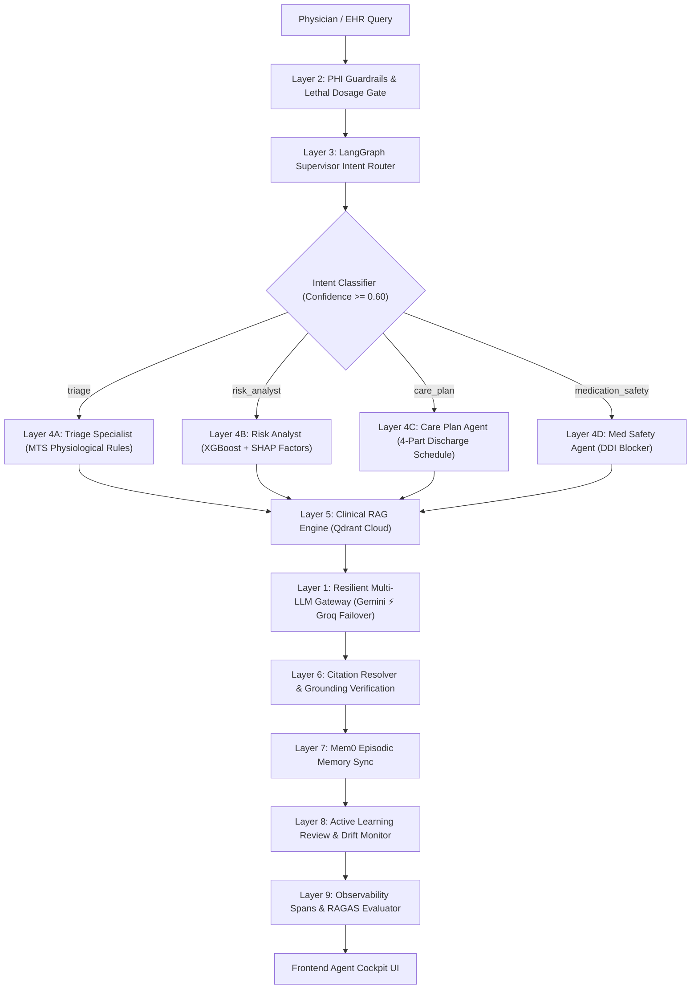

# 🏥 CareLink — Autonomous Multi-Agent HealthTech Platform
## Enterprise Clinical Intelligence & Closed-Loop Telephony Architecture Specification

**System:** CareLink Enterprise Clinical Copilot & Telemetry Escalation Platform  
**Architecture:** 12-Layer Autonomous Multi-Agent System (LangGraph, LiveKit SIP, Dual Indic Voice)  
**Lead Architect:** Nishant Maurya ([nishantma05@gmail.com](mailto:nishantma05@gmail.com))  
**Repository:** [github.com/Niss54/Care-link](https://github.com/Niss54/Care-link)  
**Production Interface:** `http://localhost:3005` (Agent Cockpit UI)

---

## 1. Executive Summary & Real-World Healthcare Problem

In modern healthcare systems and post-discharge environments, **30-day patient readmissions** after acute cardiac or metabolic events impose immense financial costs, preventable patient morbidity, and severe clinician burnout. Clinicians cannot manually review thousands of telemetry data points across hundreds of discharged patients every day. Furthermore, conventional LLMs cannot be deployed at the bedside without safety architecture: they hallucinate unverified medical advice, leak Protected Health Information (PHI) across external API boundaries, and lack deterministic escalation channels when life-threatening physiological deterioration occurs.

**CareLink** solves this crisis through a production-grade, dual-track autonomous platform:
1. **Clinical Intelligence & Safety Core (Track 1):** Wraps XGBoost readmission risk scoring, SHAP explainability, and LangGraph multi-agent triage inside a privacy-first, pharmacovigilance-gated architecture where:
   - **Zero Raw PHI Leakage:** 100% of HIPAA PII/PHI is scrubbed into reversible tokens before leaving hospital firewalls.
   - **Deterministic Pharmacovigilance & Lethal Dosage Blocking:** Hard rule engines block fatal drug interactions (e.g. Warfarin + NSAID, Metformin with eGFR < 30 mL/min) before LLM generation.
   - **Evidence-Grounded RAG with Citation Resolution:** Every clinical recommendation cites authoritative guidelines (`[ICMR-HF-01]`, `[AHA-DDI-01]`, `[KDIGO-CKD-01]`, `[WHO-RESP-01]`) with Grounding Fidelity score $\ge 0.70$.
2. **Autonomous Closed-Loop Telephony & Indic Voice Escalation (Track 2):** When acute telemetry alarms trip (e.g. $\text{SpO}_2 \le 88\%$), CareLink autonomously dials the on-call intensivist's mobile phone via **LiveKit SIP Outbound Trunking**, delivers an ultra-brief voice briefing in any of India's **22 Scheduled Languages** via **Digital India Bhashini (MeitY)** and **Sarvam AI**, and captures verbal or DTMF clinician acknowledgement to guarantee closed-loop resolution in under 20 seconds.

---

## 2. Autonomous 9-Layer Architecture Overview

CareLink implements a decoupled, fail-safe 9-layer agent architecture:



### Architectural Layer Breakdown

| Layer | Component | Function & Clinical Role |
| :--- | :--- | :--- |
| **Layer 1** | **Resilient Multi-Model Gateway** | Google Gemini 2.5 Flash primary with instantaneous $<500\text{ ms}$ auto-failover to Groq (`openai/gpt-oss-120b` / `llama-3.3-70b-versatile`) on HTTP 429 quota exhaustion. |
| **Layer 2** | **HIPAA PHI Guardrails** | Regex + NER tokenizer scrubbing patient names, MRNs, phone numbers, and SSNs. Includes hard-coded lethal dosage and self-harm blocking filters. |
| **Layer 3** | **LangGraph Supervisor Router** | StateGraph supervisor orchestrating clinical specialists. Enforces a confidence floor $\ge 0.60$ with deterministic fallback to MTS triage. |
| **Layer 4** | **Specialist Agent Cluster** | • **TriageAgent:** Manchester Triage System physiological rules + vital trigger extraction.<br>• **RiskAnalystAgent:** XGBoost 30-day readmission prediction + SHAP feature attributions.<br>• **CarePlanAgent:** 4-part post-discharge plan (medications, appointments, diet, red flags).<br>• **MedicationSafetyAgent:** OpenFDA DDI rules + Warfarin/NSAID and Metformin/eGFR contraindication blocker. |
| **Layer 5** | **Clinical RAG Engine** | Qdrant Cloud vector index synchronized with 10 evidence-based clinical protocols (ICMR, WHO, NICE, AHA, KDIGO, IAP, GOLD) with in-memory cosine fallback. |
| **Layer 6** | **Citation Resolver & Grounding** | Verifies bracketed citations `[TAG]`, audits against retrieved guidelines, computes Grounding Fidelity ($0.0 - 1.0$), and emits evidence badges. |
| **Layer 7** | **Long-Term Memory Engine** | Mem0 Cloud REST API integration with active key + local `.runtime/mem0/memories.json` fallback for patient-scoped chronic history & allergy recall across sessions. |
| **Layer 8** | **Active Learning Feedback Loop** | Clinician approvals vs overrides tracking, computing moving override rate $\rho$, alerting on clinical drift ($\rho > 15\%$), and exporting fine-tuning retraining datasets. |
| **Layer 9** | **Observability & RAGAS Evaluator** | LangSmith-compatible run trace instrumentation (`.runtime/traces/`) and standardized RAGAS evaluation runner (Faithfulness, Context Precision, Answer Relevancy). |

---

## 3. Technology Stack & Enterprise Standards

CareLink is built on modern, battle-tested technologies designed for low latency, fault tolerance, and healthcare regulatory compliance:

- **Frontend Application:** React 19, TypeScript 5.8, Vite 6.2, Tailwind CSS, Lucide Icons, Recharts, Canvas Confetti.
- **Agentic Orchestration:** LangGraph StateGraph, LangChain Core, Model Context Protocol (MCP).
- **Primary Reasoning LLM:** Google Gemini 2.5 Flash (`gemini-2.5-flash`).
- **Resilient Fallback LLM:** Groq LPU Cloud (`openai/gpt-oss-120b`, `llama-3.3-70b-versatile`).
- **Vector Database (RAG):** Qdrant Cloud (Cosine metric, 384-dimensional dense vectors) with local memory fallback.
- **Episodic Memory Store:** Mem0 Cloud REST API with local encrypted JSON cache.
- **Relational Backend & Auth:** Supabase PostgreSQL with Row-Level Security (RLS) policies.
- **Real-Time Telephony:** LiveKit Cloud SIP trunking and WebRTC audio agents.
- **Indic Voice Dual-Engine:** Digital India Bhashini (MeitY) and Sarvam AI foundation models.
- **Clinical Protocols Enforced:** ICMR (Indian Council of Medical Research), AHA (American Heart Association), KDIGO, WHO, NICE, GOLD.

---

## 4. End-to-End Clinical Verification Flow

### Phase 1: Patient Admission & Telemetry Monitoring
1. Real-time patient telemetry (heart rate, blood pressure, $\text{SpO}_2$, respiratory rate) streams into the clinical monitoring pipeline.
2. The **XGBoost 30-Day Readmission Engine** computes a calibrated probability of hospital readmission and extracts the top 3 contributing factors via SHAP.

### Phase 2: Autonomous Agent Intent Routing & Triage
1. When a clinician queries the copilot, the **Layer 2 Zero-PHI Guardrail** strips all protected identifiers before dispatching to the supervisor.
2. The **LangGraph Supervisor** identifies the intent (e.g. emergency triage vs care plan formulation) and routes control to the appropriate sub-agent.
3. The **Clinical RAG Engine** retrieves relevant clinical guidance chunks from Qdrant Cloud and injects them into the agent's context window.

### Phase 3: Pharmacovigilance & Closed-Loop Escalation
1. If high-risk drug combinations or contraindications are detected, the **Medication Safety Agent** deterministically aborts unsafe generations and issues clinical contraindication warnings.
2. If acute patient deterioration is flagged (e.g. sudden desaturation below 88%), the **LiveKit Telephony Worker** automatically initiates an outbound SIP call to the attending intensivist in the clinician's preferred Indic language.

---

## 5. Verification & Automated Test Matrix

All layers are equipped with automated test suites in both **Python 3.12** and **TypeScript / tsx**:

```bash
# Phase 1: Dual-Model Failover Gateway
python backend/tests/test_failover.py
npx tsx scripts/test_failover.ts

# Phase 2: PHI Guardrails & Qdrant Clinical RAG
python backend/tests/test_phase2_rag.py
npx tsx scripts/test_phase2_rag.ts

# Phase 3: LangGraph Supervisor & Specialist Agents
python backend/tests/test_phase3_agents.py
npx tsx scripts/test_phase3_agents.ts

# Phase 4: Long-Term Memory (Mem0) & Active Learning
python backend/tests/test_phase4_memory.py
npx tsx scripts/test_phase4_memory.ts

# Phase 6: RAGAS Evaluation Benchmark Suite
python backend/tests/test_phase6_ragas.py
npx tsx scripts/test_phase6_ragas.ts

# Phase 6: Full 9-Layer End-to-End Pipeline Integration Test
python backend/tests/test_phase6_e2e.py
npx tsx scripts/test_phase6_e2e.ts

# TypeScript Lint & Client Production Build
npm run lint
npm run build:client
```

---

*CareLink Enterprise Architecture — Nishant Maurya.*
